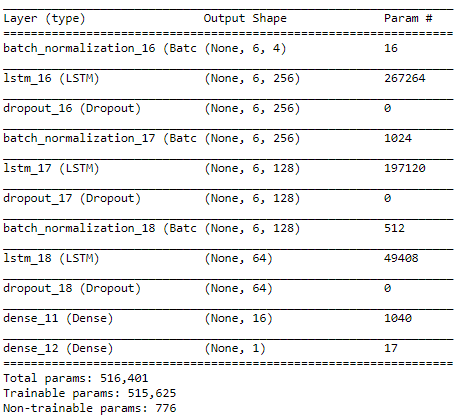
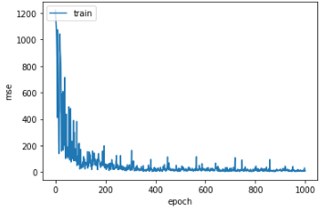
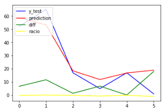
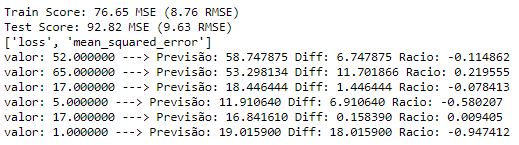

# [Sales forecast with Long Short Term Memory networks.](https://github.com/marceloqueiros/LSTM-sales-prediction)
[Marcelo Queirós](https://www.linkedin.com/in/marceloqueiros/)

## Introduction
The work has as its object a dataset with advertising expenditures of a dietary weight control product with the registration of 36 consecutive months.
The dataset is available at: [dataset for sales forecasting](https://datamarket.com/data/set/22kw/advertising-and-sales-data-36-consecutive-monthly-sales-and-advertising-expenditures-of-a-dietary-weight-control-product#!ds=22kw!2ekl&display=line). 

The goal is a network that forecasts future sales using only the monthly data of 2 years of sales and advertising spend. 
The third year is used for comparison with the data that the algorithm will predict for this same year.

## Network
Several architectures were tested, the one that obtained better results was:

|  |
|:--:| 
| **Fig.1:** Architecture. |

## Results

MSE declined rapidly in the first 200 epochs and then stabilized.

|  |
|:--:| 
| **Fig.2:** MSE evolution in 1000 epochs. |

The following chart shows the forecast for the last 5 months of the third year. We can verify that the blue line (real data) and the red line (predicted data) are very similar. Considering that only 2 variables (sales and advertising) were taken into account during a period of 2 years, these results are good.

|   |
|:--:| 
| **Fig.3:** Results. |
